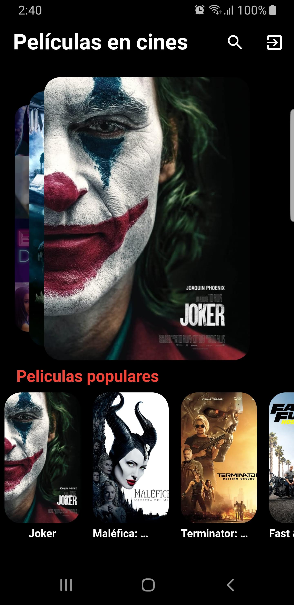
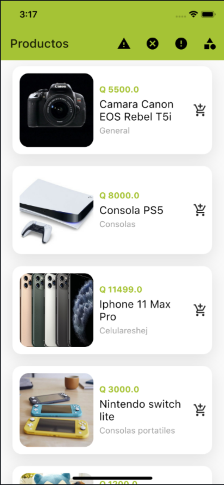

### Hi there 👋
## 👨🏻‍💻 About me
My name is Renato Montufar, I am a mobile developer, I love UI/UX and I am learning new things all the time. Feel free to contact me! 😀

- [LinkedIn](https://www.linkedin.com/in/deus-magna/)
- [GitHub](https://github.com/deus-magna/)
- [Twitter](https://twitter.com/deus_magna)
- [Instagram](https://www.instagram.com/deus_magna/) 
    
## 👀 My GutHub Stats

  

    
  

&nbsp;&nbsp;

  

    
  

## 🤝 Contributing

Contributions, issues and feature requests are welcome!

## 🤔 Questions?
You can find me on   

## Show your support

Give a ⭐️ if some project helped you!

## 📲 💻 🖥 My work

| [Supercines](https://github.com/deus-magna/supercines/blob/main/README.md)      | [IronMan Suits](https://github.com/deus-magna/ironman-suits-app) |
| ----------- | ----------- |
|     |        |

| [Peliculas-app](https://github.com/deus-magna/peliculas-app)      | [API Practice](https://github.com/deus-magna/restapi_practice) |
| ----------- | ----------- |
|     |        |

| [Batman SigIn](https://github.com/deus-magna/batman_signin)      | [Flutter Designs](https://github.com/deus-magna/flutter-designs) |
| ----------- | ----------- |
|     |        |

| [Products App](https://github.com/deus-magna/flutter-products-app)      | [Flutter Skin Selector](https://github.com/deus-magna/flutter-skin-selector) |
| ----------- | ----------- |
|     |        |

<!--
**deus-magna/deus-magna** is a ✨ _special_ ✨ repository because its `README.md` (this file) appears on your GitHub profile.

Here are some ideas to get you started:

- 🔭 I’m currently working on ...
- 🌱 I’m currently learning ...
- 👯 I’m looking to collaborate on ...
- 🤔 I’m looking for help with ...
- 💬 Ask me about ...
- 📫 How to reach me: ...
- 😄 Pronouns: ...
- ⚡ Fun fact: ...
-->
